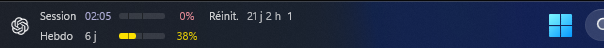
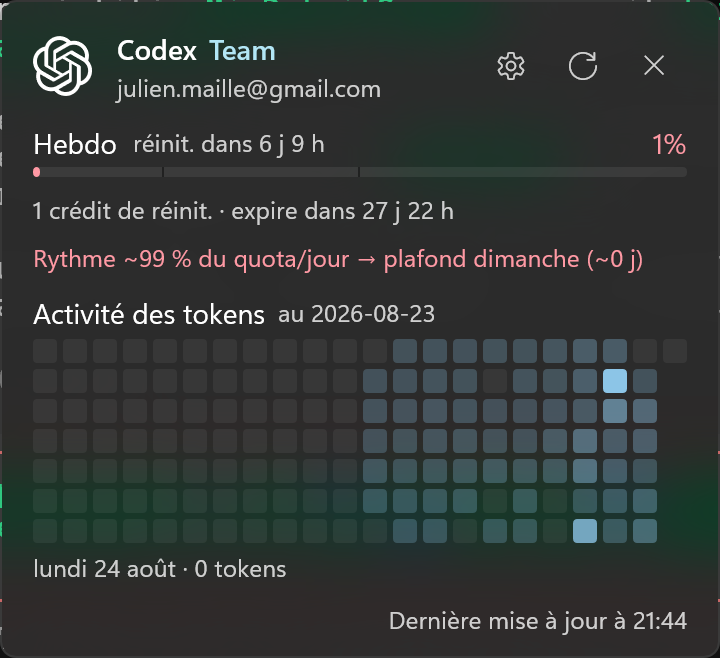

# CodexQuota

A native Windows taskbar widget showing your Codex usage quota: remaining session and weekly percentage, reset countdowns, and credits, drawn as a WinUI tile next to the system tray. Click the tile for a flyout with per-meter bars, reset credits, and appearance toggles.

Fork of [TaskbarQuota](https://github.com/zioder/TaskbarQuota) (MIT), trimmed to a single Codex provider (no dashboard, no agent-activity island, no main window).

> Disclaimer: this codebase is mostly vibe-coded, written with AI assistance and heavy iteration. It is still reviewed, planned, and tested (154 unit tests).

## Screenshots





## Features

- Taskbar tile next to the notification area: remaining quota with progress bar and reset countdown (`6d 22h`), switching to an absolute date when the reset is within 24 hours.
- Flyout on click: plan + email, per-meter bars (session, weekly, monthly, model, credits), reset countdowns, credit balance, oldest reset-credit expiry.
- Profile activity heatmap in the flyout: a GitHub-style grid of daily token squares spanning 22 weeks, with the low-density history filled from local session journals (server data stays authoritative where both exist).
- Persistent toggles in the flyout (`HKCU\Software\CodexQuota`): icon, progress bars, colored percent (amber at 50% remaining or less, red at 20% or less).
- Tray menu: Move, Reset position, Refresh, Quit.
- Auto-starts at logon.

## Install

Download `CodexQuotaSetup-<version>-x64.exe` (`-arm64` for ARM Windows) from the [Releases page](https://github.com/JulienMaille/CodexQuota/releases). SmartScreen may warn on unsigned builds; choose More info > Run anyway.

Requires `codex login` (or `OPENAI_API_KEY` in `%USERPROFILE%\.codex\auth.json`).

## Build, test, publish

.NET SDK 9.0.x on Windows 11 (or 10 19041+).

```powershell
dotnet build CodexQuota.slnx -c Release
dotnet test CodexQuota.slnx -c Release
dotnet publish src/CodexQuota.App/CodexQuota.App.csproj -c Release -r win-x64 --self-contained false
```

## How it gets data

The app runs on your PC; the only network traffic is a direct call to OpenAI's ChatGPT usage API with your own Codex token (`chatgpt.com/backend-api/wham/usage`, plus the reset-credits and profile endpoints). Token read from `%USERPROFILE%\.codex\auth.json` (or `%CODEX_HOME%`), used in memory only. `chatgpt_base_url` in `~/.codex/config.toml` overrides the endpoint. No telemetry or cookies. The app locally checks whether a `codex` process is running only to choose a faster refresh cadence; process names and details never leave the machine. It also reads local token-count events from `%USERPROFILE%\.codex\sessions` (or `%CODEX_HOME%\sessions`) to fill the days the profile endpoint does not report — that endpoint's window is ~8 weeks, so the 22-week heatmap's older days come from these journals; only aggregated token counts are used, and server buckets stay authoritative where both exist.

Logs to `%TEMP%\CodexQuota.log`; usage snapshots persist to `%LOCALAPPDATA%\CodexQuota\usage-snapshots.json`.

## License

MIT. See [LICENSE](LICENSE). Upstream: [TaskbarQuota](https://github.com/zioder/TaskbarQuota).
